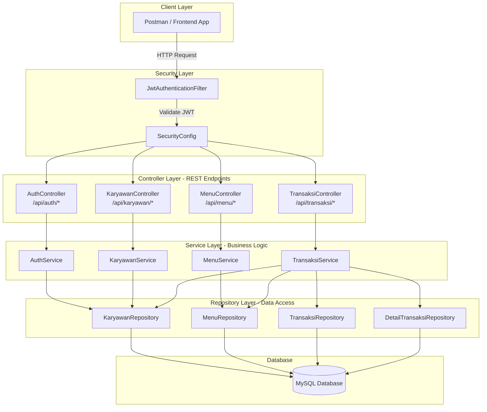
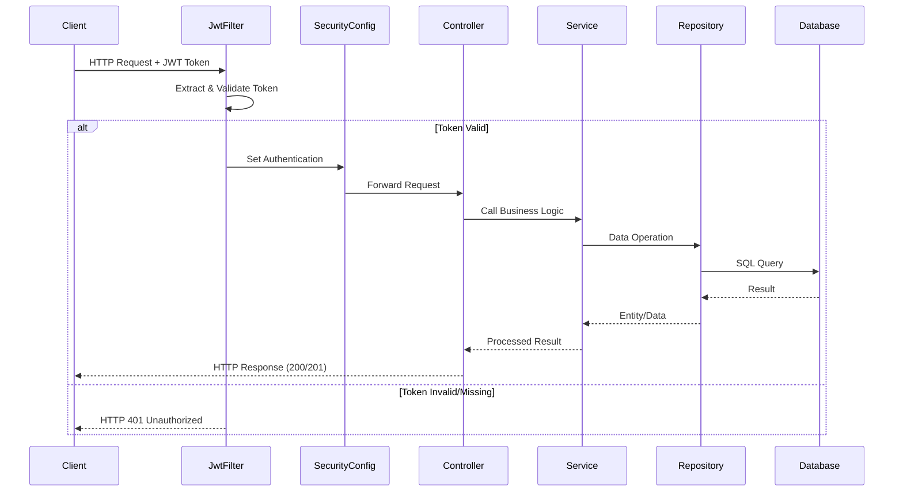
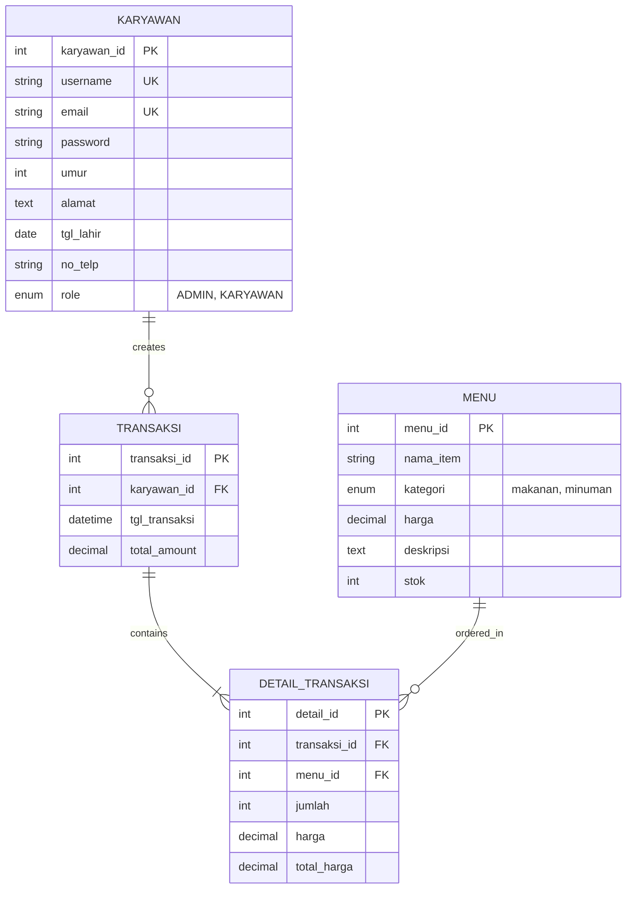
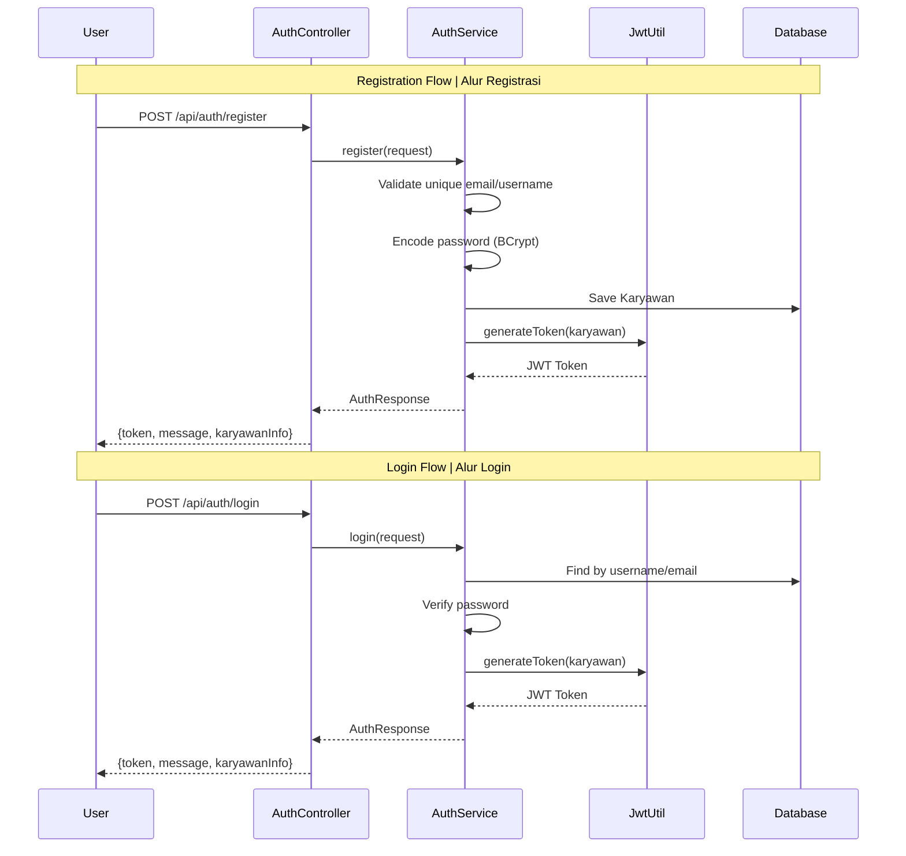
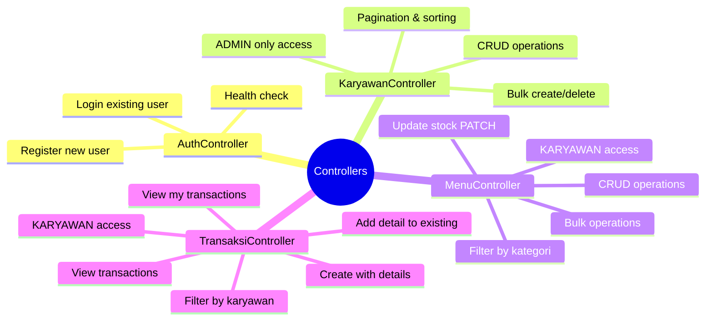
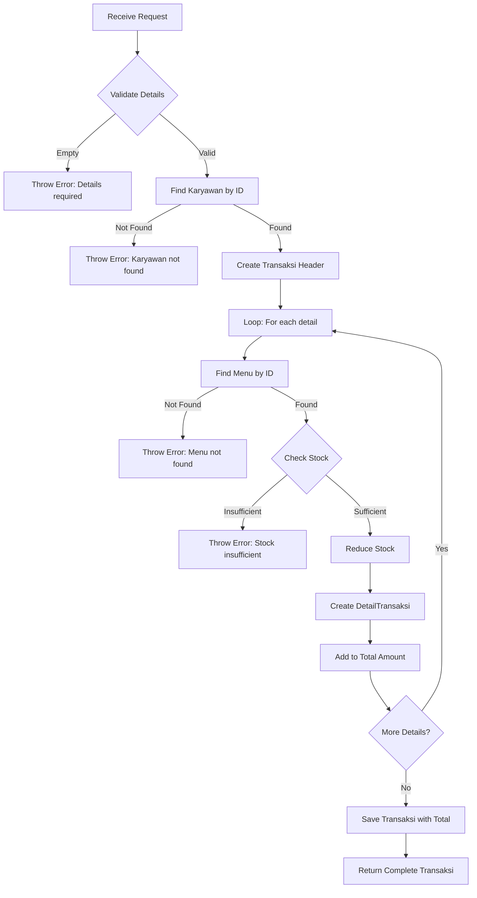
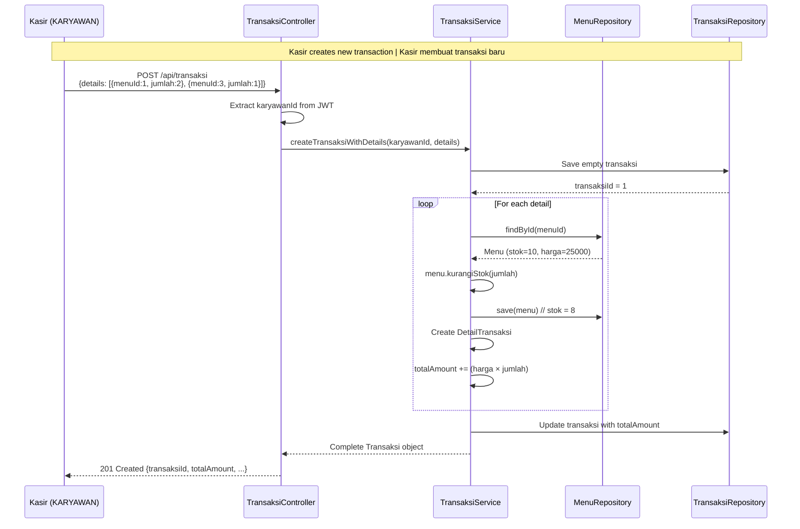
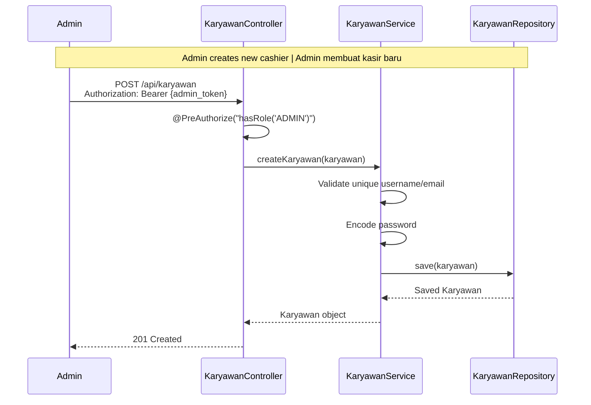

# 📚 FLOW GUIDE - Group-8 Transaction System
# Panduan Alur Sistem - Sistem Transaksi Group-8

> **Bilingual Documentation | Dokumentasi Dwibahasa**
> 
> This guide explains the system architecture and flow of the Group-8 Transaction API.
> Panduan ini menjelaskan arsitektur dan alur sistem API Transaksi Group-8.

---

## 📖 Table of Contents | Daftar Isi

1. [System Overview | Gambaran Sistem](#1-system-overview--gambaran-sistem)
2. [Architecture Diagram | Diagram Arsitektur](#2-architecture-diagram--diagram-arsitektur)
3. [Database Schema | Skema Database](#3-database-schema--skema-database)
4. [Security & Authentication | Keamanan & Autentikasi](#4-security--authentication--keamanan--autentikasi)
5. [Controller Layer | Lapisan Controller](#5-controller-layer--lapisan-controller)
6. [Service Layer | Lapisan Service](#6-service-layer--lapisan-service)
7. [Business Flow Examples | Contoh Alur Bisnis](#7-business-flow-examples--contoh-alur-bisnis)

---

## 1. System Overview | Gambaran Sistem

### English
This is a **REST API** for a cafe/restaurant transaction management system built with:
- **Spring Boot 3.x** - Java framework for building web applications
- **Spring Security** - For authentication and authorization
- **JWT (JSON Web Token)** - For stateless authentication
- **JPA/Hibernate** - For database operations
- **MySQL** - Database storage

### Bahasa Indonesia
Ini adalah **REST API** untuk sistem manajemen transaksi kafe/restoran yang dibangun dengan:
- **Spring Boot 3.x** - Framework Java untuk membangun aplikasi web
- **Spring Security** - Untuk autentikasi dan otorisasi
- **JWT (JSON Web Token)** - Untuk autentikasi stateless
- **JPA/Hibernate** - Untuk operasi database
- **MySQL** - Penyimpanan database

---

## 2. Architecture Diagram | Diagram Arsitektur

### Layered Architecture | Arsitektur Berlapis



### Request Flow | Alur Permintaan



---

## 3. Database Schema | Skema Database

### Entity Relationship Diagram | Diagram Relasi Entitas



### Table Descriptions | Deskripsi Tabel

| Table | Description (EN) | Deskripsi (ID) |
|-------|------------------|----------------|
| `karyawan` | Stores employee data who can access the system | Menyimpan data karyawan yang dapat mengakses sistem |
| `menu` | Stores food and drink items with stock | Menyimpan item makanan dan minuman beserta stok |
| `transaksi` | Stores transaction headers (date, total, who created) | Menyimpan header transaksi (tanggal, total, pembuat) |
| `detail_transaksi` | Stores individual items in each transaction | Menyimpan item-item dalam setiap transaksi |

---

## 4. Security & Authentication | Keamanan & Autentikasi

### JWT Authentication Flow | Alur Autentikasi JWT



### Role-Based Access Control | Kontrol Akses Berbasis Role

| Role | Accessible Endpoints | Endpoint yang Dapat Diakses |
|------|---------------------|----------------------------|
| **PUBLIC** | `/api/auth/*` | Registrasi, Login, Health Check |
| **ADMIN** | `/api/karyawan/*` | CRUD Karyawan (semua karyawan) |
| **KARYAWAN** | `/api/menu/*`, `/api/transaksi/*` | CRUD Menu, CRUD Transaksi |

> **Note | Catatan:** ADMIN role inherits KARYAWAN permissions in most cases.
> Role ADMIN mewarisi izin KARYAWAN dalam sebagian besar kasus.

### JWT Token Structure | Struktur Token JWT

```json
{
  "header": {
    "alg": "HS256",
    "typ": "JWT"
  },
  "payload": {
    "sub": "kasir_andi",      // username
    "id": 1,                   // karyawanId
    "email": "andi@cafe.com",
    "role": "KARYAWAN",
    "iat": 1703404800,         // issued at
    "exp": 1703491200          // expires (24h)
  }
}
```

---

## 5. Controller Layer | Lapisan Controller

### Controller Responsibilities | Tanggung Jawab Controller



### Endpoint Summary | Ringkasan Endpoint

#### AuthController (`/api/auth`)
| Method | Endpoint | Description (EN) | Deskripsi (ID) |
|--------|----------|------------------|----------------|
| POST | `/register` | Register new employee | Registrasi karyawan baru |
| POST | `/login` | Login and get JWT token | Login dan dapatkan token JWT |
| GET | `/health` | Check if service is running | Cek apakah service berjalan |

#### KaryawanController (`/api/karyawan`) - **ADMIN Only**
| Method | Endpoint | Description (EN) | Deskripsi (ID) |
|--------|----------|------------------|----------------|
| GET | `/` | Get all with pagination | Ambil semua dengan paginasi |
| GET | `/{id}` | Get by ID | Ambil berdasarkan ID |
| POST | `/` | Create new | Buat baru |
| POST | `/bulk` | Create max 5 at once | Buat maksimal 5 sekaligus |
| PUT | `/{id}` | Update by ID | Update berdasarkan ID |
| DELETE | `/{id}` | Delete by ID | Hapus berdasarkan ID |
| DELETE | `/bulk` | Delete max 5 at once | Hapus maksimal 5 sekaligus |

#### MenuController (`/api/menu`) - **KARYAWAN Access**
| Method | Endpoint | Description (EN) | Deskripsi (ID) |
|--------|----------|------------------|----------------|
| GET | `/` | Get all with pagination | Ambil semua dengan paginasi |
| GET | `/{id}` | Get by ID | Ambil berdasarkan ID |
| GET | `/kategori/{kategori}` | Filter by category | Filter berdasarkan kategori |
| POST | `/` | Create new menu | Buat menu baru |
| POST | `/bulk` | Create max 5 at once | Buat maksimal 5 sekaligus |
| PUT | `/{id}` | Full update | Update lengkap |
| PATCH | `/{id}/stok` | Update stock only | Update stok saja |
| DELETE | `/{id}` | Delete by ID | Hapus berdasarkan ID |
| DELETE | `/bulk` | Delete max 5 at once | Hapus maksimal 5 sekaligus |

#### TransaksiController (`/api/transaksi`) - **KARYAWAN Access**
| Method | Endpoint | Description (EN) | Deskripsi (ID) |
|--------|----------|------------------|----------------|
| GET | `/` | Get all with pagination | Ambil semua dengan paginasi |
| GET | `/{id}` | Get by ID | Ambil berdasarkan ID |
| GET | `/karyawan/{id}` | Get by karyawan ID | Ambil berdasarkan ID karyawan |
| GET | `/my` | Get my transactions | Ambil transaksi saya |
| POST | `/` | Create with details | Buat dengan detail |
| GET | `/{id}/detail` | Get transaction details | Ambil detail transaksi |
| POST | `/{id}/detail` | Add detail to transaction | Tambah detail ke transaksi |

---

## 6. Service Layer | Lapisan Service

### Service Responsibilities | Tanggung Jawab Service

| Service | Responsibilities (EN) | Tanggung Jawab (ID) |
|---------|----------------------|---------------------|
| **AuthService** | Handle registration, login, password encoding, JWT generation | Menangani registrasi, login, encoding password, pembuatan JWT |
| **KaryawanService** | CRUD operations, validation, bulk operations | Operasi CRUD, validasi, operasi bulk |
| **MenuService** | CRUD operations, stock management, category filtering | Operasi CRUD, manajemen stok, filter kategori |
| **TransaksiService** | Create transactions, auto-calculate totals, stock reduction | Buat transaksi, hitung total otomatis, pengurangan stok |

### Transaction Service Flow | Alur Service Transaksi



---

## 7. Business Flow Examples | Contoh Alur Bisnis

### Example 1: Complete Transaction Flow | Alur Transaksi Lengkap



### Example 2: Admin Managing Employees | Admin Mengelola Karyawan



---

## 🎯 Quick Start | Mulai Cepat

### Prerequisites | Prasyarat
1. Java 17+ installed | Java 17+ terinstall
2. MySQL running on port 3306 | MySQL berjalan di port 3306
3. Database `transaksi` created | Database `transaksi` sudah dibuat

### Run Application | Jalankan Aplikasi
```bash
# Navigate to project root | Navigasi ke root proyek
cd "d:\Data\Tugas Kuliah\ccit\Phase 6 (MAR)\Pakhir\Group-8_R2Bfinal"

# Run with Maven Wrapper | Jalankan dengan Maven Wrapper
./mvnw spring-boot:run
```

### Test Endpoints | Tes Endpoint
1. Open Postman | Buka Postman
2. Import collection from `docs/Group8_API.postman_collection.json`
3. Start with `/api/auth/register` or `/api/auth/login`
4. Copy the JWT token and use it in other requests

---

> **Next Step | Langkah Selanjutnya:** See [POSTMAN_TUTORIAL.md](./POSTMAN_TUTORIAL.md) for detailed API testing guide.
> Lihat [POSTMAN_TUTORIAL.md](./POSTMAN_TUTORIAL.md) untuk panduan testing API yang detail.
